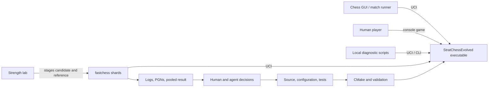
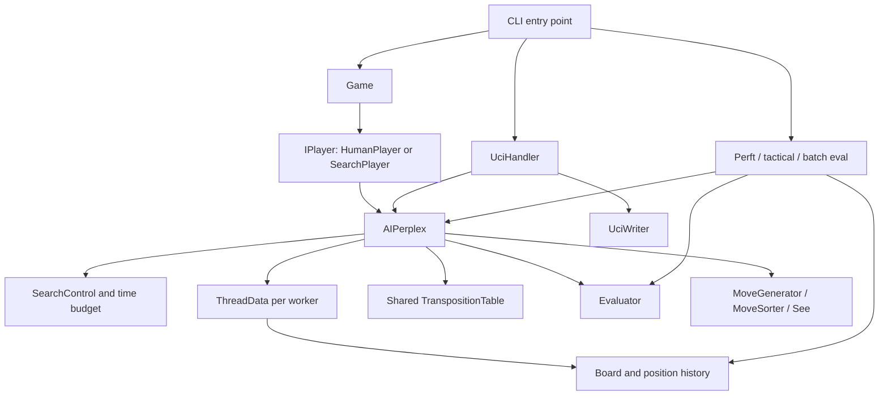
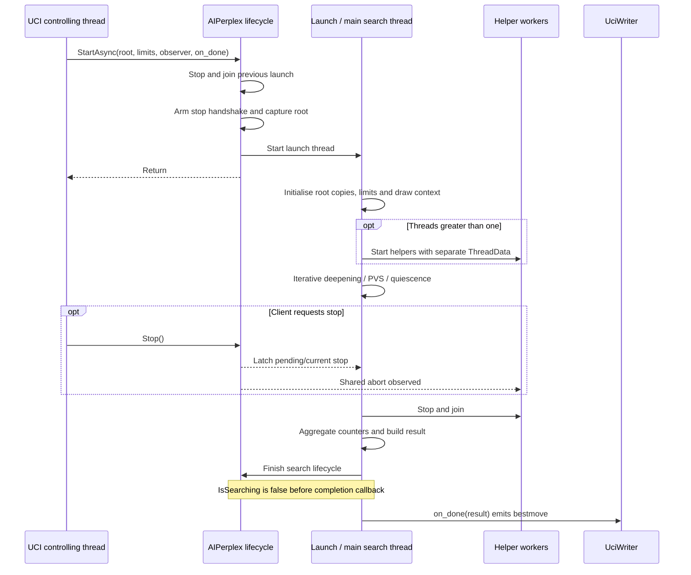
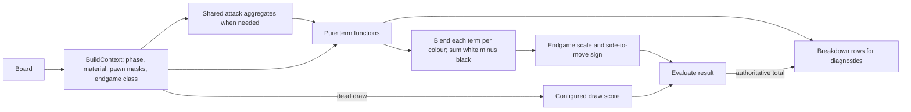
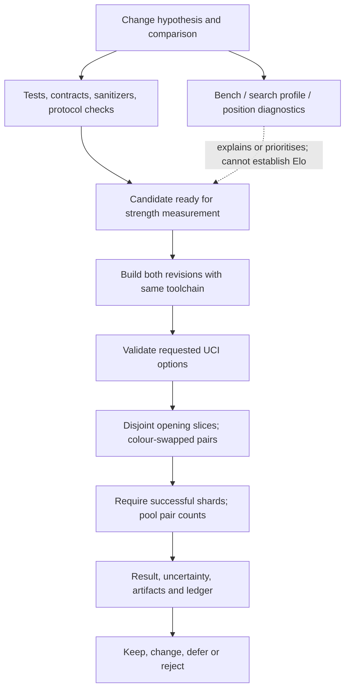

# Architecture: current system

Last verified: 2026-10-04.

Start here for responsibilities and execution. Read [CONTEXT](../CONTEXT.md) for domain
definitions, [EngineContracts](EngineContracts.md) before changing behaviour, and
[TestDesign](TestDesign.md) for existing test surfaces. Those documents retain their own jobs;
this map does not replace their detailed contracts.

## 1. System and consumers

The product is a C++23 chess engine with a UCI interface, an interactive game mode and diagnostic
CLI modes. The system context below includes the development feedback loop.

The diagrams below show logical modules and ownership; boxes do not imply separate processes,
libraries or virtual interfaces.

## 2. Logical modules

The `Player -> AIPerplex` edge belongs to `SearchPlayer`; `HumanPlayer` does not search. The
tools box is a collection of consumers: perft does not invoke evaluation or the search algorithm.

| Module | Responsibility and interface | Important dependencies / constraints |
|---|---|---|
| `Board` | Position, make/unmake, position metadata, hash and history | Owns the state that legality, repetition and evaluation inspect. Search uses a copy. |
| `Move` / `MoveFormatter` | Encoded move value / context-dependent presentation and parsing | [Move contracts](EngineContracts.md#moves). |
| `MoveGenerator` | Candidate moves and attack geometry | [Generation contract](../StratEngine/MoveGenerator.h). |
| `MoveSorter` / `See` | Ordering and static exchange judgement | Consume board and ordering state; ordering interacts with selective search. |
| `AIPerplex` | Root search, async lifecycle, iterative deepening, recursive search, result assembly | Owns TT, evaluator, search control, tuning and worker state. One controlling thread owns lifecycle/configuration calls. |
| `IterationPolicy` | Main-thread iteration acceptance, retained-result updates and continuation | Two pure value transitions; no Board, TT, clock or callback access. The driver supplies observations and owns side effects. |
| `ThreadData` | Per-worker position, PV, counters, history and recursion scratch | Includes several lifetimes: per-node, per-search and state retained between moves. Not a purely temporary search record. |
| `SearchControl` | Resolve/apply limits, stop latch, time and node checks | Shared stop condition; main worker polls limits. |
| `TranspositionTable` | Cache searched scores/bounds and ordering hints | Packed entries, four per aligned bucket, each two XOR-validated relaxed atomic words, no locks; receives keys, not Boards. |
| `Evaluator` | Static score and explanatory breakdown | Pure per-position term calculations plus a draw-score pair configured before search workers start. |
| `SearchTuningSchema` | Validate and bind configuration | `SearchTuning.def` is the catalogue; JSON and UCI exposure are deliberately not identical. |
| `UciHandler` / `UciWriter` | Protocol parsing, lifecycle coordination and serialized output | Owns a Board, concrete search instance and a separate unconfigured evaluator for `eval`. |
| `Game` / `SearchPlayer` | Commit moves and adjudicate game play / adapt search to `IPlayer` | Game keeps the played Board; a returned `SearchResult` is the search's output. |

Source entry points: [AIPerplex.h](../StratEngine/AIPerplex.h),
[Board.h](../StratEngine/Board.h), [MoveGenerator.h](../StratEngine/MoveGenerator.h),
[ThreadData.h](../StratEngine/ThreadData.h), [Eval.h](../StratEngine/Eval.h),
[UCIHandler.h](../StratEngine/UCIHandler.h), [SearchPlayer.cpp](../StratEngine/SearchPlayer.cpp).

`Board` maintains both bitboards and a square-indexed mailbox, incremental Zobrist keys, repetition
history and ply-indexed undo state. Sliding attacks use compile-time tables indexed through PEXT:
[Magic.h](../StratEngine/Magic.h). These representations serve different queries on the same position.

### Configuration and input boundaries

| Layer | Owner / when it takes effect | What the strength lab can vary |
|---|---|---|
| Build configuration | [CMakeLists.txt](../CMakeLists.txt); applied when building. CMake settings select compiler flags and target definitions. `STRAT_SANITIZE` selects instrumentation; `STRAT_ENABLE_TEST_ACCESS` is defined for the test target. | `cmake_defines` passes the same CMake arguments to both revisions. Target definitions are not automatically dispatchable CMake settings. |
| Search tuning catalogue | [SearchTuning.def](../StratEngine/SearchTuning.def) owns defaults, ranges, availability and separate JSON/UCI exposure. [SearchTuningSchema](../StratEngine/SearchTuningSchema.h) validates updates; the search service applies them between searches. | Exposed UCI fields can differ between candidate/reference or candidate arms. JSON-only fields cannot be varied through the lab's UCI option inputs. |
| Interactive game settings | [Config.cpp](../StratEngine/Config.cpp) reads `game_settings.json`; [PlayerFactory](../StratEngine/PlayerFactory.cpp) configures each player. | The lab runs UCI engines. That path starts from its own defaults and does not load `game_settings.json`. |
| UCI engine options | [UciHandler](../StratEngine/UCIHandler.cpp) handles `Hash`, `Threads` and exposed tuning fields through `setoption`; changes are refused during search. | Advertised options can be supplied per side; the workflow reserves `Threads` and supplies it itself. |
| Per-search limits | UCI `go` becomes [SearchLimits](../StratEngine/SearchLimits.h); [SearchControl](../StratEngine/SearchControl.h) applies the limits for that search. | The match runner supplies clocks from each side's time control; these are distinct from engine tuning options. |

FEN enters through [FENParser](../StratEngine/Utils/FENParser.h) and `Board::SetupFromFEN`; UCI
parsing belongs to `UciHandler`, and JSON game configuration to `Config.cpp`. Recovery depends on
the boundary: a rejected UCI FEN reports the rejection, resets to the starting position and keeps
the session alive; some malformed or unknown options are ignored. See the
[threat model](Workflow.md#threat-model) for the robustness goal, and those owners for the actual
error/recovery contracts.

### Search mechanism index

This is navigation into [AIPerplex.cpp](../StratEngine/AIPerplex.cpp), not a second catalogue of
defaults or algorithms. Tuning field families below are defined in
[SearchTuning.def](../StratEngine/SearchTuning.def); eligibility and correctness guards remain in
the implementation and [search contracts](EngineContracts.md#search-internals).

| Mechanism | Implementation entry | Control / related state |
|---|---|---|
| Iteration acceptance and continuation | [IterationPolicy](../StratEngine/IterationPolicy.h): `Engine::assess_iteration`, `Engine::continue_iteration` | `min_nodes_threshold`, `min_completion_ratio`, `min_pv_ratio`; retained result and one-extension state |
| Time and node observations | `SearchControl`, iterative-deepening loop | Per-search limits and abort latch; soft-limit sample acquired after the iteration observer |
| Aspiration windows | `search_with_aspiration` | `aspiration_*` |
| PVS and TT cutoffs | `pvs` | Window/node type, TT bound and depth, exclusion-frame restrictions |
| Reverse futility | `reverse_futility_eligible`, `pvs` | `reverse_futility_*` |
| Null move | `should_try_null_move`, `pvs` | `null_move_*`; worker recursion state |
| Singular extension | `pvs` verification search | `singular_*`; TT evidence and excluded move |
| Frontier futility | `frontier_futility_eligible`, `pvs` | `frontier_futility_*` |
| Late move pruning | `late_move_pruning_eligible`, `pvs` | `late_move_pruning_enabled`; thresholds in [AIPerplex.h](../StratEngine/AIPerplex.h) |
| Late move reduction | `pvs` reduced search and re-search | `lmr_*`; move classification and ordering |
| Quiescence delta / SEE pruning | `quiescence` | `delta_pruning_margin`, `see_pruning_enabled`, `see_pruning_margin`; material and check guards |
| Move ordering and history | [MoveSorter::ScoreMoves](../StratEngine/Sort.h), `order_quiescence_moves`, [ThreadData](../StratEngine/ThreadData.h) | Hash move, SEE tiers, killers, history; `continuation_history_plies` |

## 3. State ownership and lifetimes

| State | Owner | Lifetime / access |
|---|---|---|
| Played or analysed root Board | UCI or Game | Caller may prepare another position after the search lifecycle allows it. Search never writes results into this Board. |
| TT allocation, tuning, evaluator, helper-state allocations | AIPerplex | Persist across searches. Tuning changes clear TT contents; new-game reset clears accumulated game state. |
| Root colour and evaluator draw scores | AIPerplex / its evaluator | Established before helper creation; read-only during search. Nonzero contempt also affects TT validity. |
| Board, PV, node counters, telemetry | One `ThreadData` per worker | Board copied from root; counters reset for each search. Mutable only by that worker while searching. |
| History and continuation history | Same worker state | Retained and aged within a game, reset for a new game. Ordinary and continuation history have different ageing schedules. |
| Excluded move, continuation keys, null-move flags | Worker recursion state | Ply-indexed scratch. Singular verification re-enters at the same ply and must restore the surrounding frame's state. |
| TT entries | Shared table | Concurrent probes/stores are lock-free; racing stores can lose an entry, and a probe may return another position's entry, like a key collision. Whole-table lifecycle operations have additional caller constraints. |
| Limits and abort latch | SearchControl | One search; stop can be requested concurrently. |
| Retained iteration result and soft-limit extension | Local `Engine::IterationState` in main iterative deepening | One search; passed through the policy's value transitions. Helpers do not use it. |
| Iteration observer and completion callback | One search/launch | Observations are snapshots. Completion runs after search has finished, on the launch thread. |
| Final SearchResult | Returned value owned by caller | Assembled after helper joins; later searches cannot overwrite it. |

### UCI launch and completion

The root is captured for asynchronous launch and copied into worker Boards. Helpers contribute TT
entries and work counts; their best moves are not selected as independent candidates. Main search
remains authoritative. `Threads=1` avoids helper spawning.

Controlled fixed-depth searches at one thread, with identical configuration and initial state,
support node-identical comparisons. Timed or externally interrupted searches need not finish at
the same point even at one thread. Lazy SMP adds scheduling-dependent shared-TT interactions;
the [equivalence check](../Scripts/Compare-SearchEquivalence.ps1) deliberately uses one thread.

TT entry storage uses a Linux allocator that requests huge-page backing for sufficiently
large allocations. `MADV_HUGEPAGE` is advisory; Windows uses the standard allocator path.
See [TranspositionTable.cpp](../StratEngine/TranspositionTable.cpp) and
[TranspositionTable.h](../StratEngine/TranspositionTable.h) when comparing platform-sensitive costs.

Inside recursion the critical order is **make → search/re-search → undo → abort check → persistent
result writes**. Counters intentionally survive an abort. Singular verification has a restricted
move set and cannot treat its own result as an ordinary TT result for the full position. A diagram
cannot replace those exact guards: see [Search internals](EngineContracts.md#search-internals)
and [AIPerplex.cpp](../StratEngine/AIPerplex.cpp).

## 4. Evaluation data flow

`EvalContext` is stack-local; individual terms do not mutate a shared accumulator or each other's
state. Shared attack generation already avoids repeating expensive slider work across mobility,
rook and king-safety terms. Integer blending happens per term and colour, so moving the blend after
summation would change scores through rounding.

`Breakdown` uses the production context and term functions and obtains its total from `Evaluate`.
It deliberately repeats some work on a diagnostic path. It is a real second consumer of the term
calculations, and many tests already use it. A breakdown is not yet an exported vector of tunable
features: it contains weighted, blended contributions, including nonlinear and conditional work.

Source: [Eval.cpp](../StratEngine/Eval.cpp), especially `BuildContext`, `RawWhitePov`, `Evaluate`
and `Breakdown`; [EvalTestFixture.h](../StratChessTests/EvalTestFixture.h).

## 5. Build, tests and experiments

Both executables compile the engine sources. The production Release target enables LTO when
supported; the test executable does not. The test target defines test access and search/TT profile
instrumentation. This makes tests useful for inspecting internals, but they are not the production
binary. Protocol-level checks, equivalence, tactical execution and matches exercise that binary.
This topology is an existing trade-off, not evidence by itself that separate libraries are needed.
Source: [CMakeLists.txt](../CMakeLists.txt), target definitions.

[CI.md](CI.md) maps the correctness gates and workflow triggers. [Scripts](../Scripts/) contains
local validation and diagnostic tooling; [TestDesign](TestDesign.md) maps the test surfaces.

This shows the responsibilities of the current tools, not an automatically enforced end-to-end
pipeline. Strength dispatch is manual. The lab uses colour-swapped pairs and disjoint opening
slices. A failed shard prevents a pooled verdict. Build/toolkit staging happens once; all shards
consume those binaries. Runtime inputs, defaults and pinned dependencies live in
[strength.yml](../.github/workflows/strength.yml).

Multi-arm screening distributes candidate option sets across shards against a shared reference,
pooling each arm separately. An opening offset lets a later confirmation use fresh openings;
the caller chooses the offset to keep runs disjoint.

| Question | Existing evidence source | Limit of the answer |
|---|---|---|
| Does a contract hold? | Focused tests, sanitizers, perft, protocol tests | Does not establish strength. |
| Did a supposedly neutral change alter search? | `Compare-SearchEquivalence.ps1` | Deterministic finite corpus at one thread; not a proof for all positions, abort schedules or SMP. |
| Did equivalent work get faster? | Interleaved shipping-build bench, accounting for code placement | Nps is not Elo; changed trees also change the work mixture. |
| What did a heuristic do? | Search profile, term breakdown, position diagnostics | Describes mechanisms; does not judge full-game strength. |
| Is this configuration stronger under the tested conditions? | Timed games and pooled paired result | Specific to opponent/reference, build, book, time control and thread count. |

Measurement method: [measure-strength](../.claude/skills/measure-strength/SKILL.md).
Recording: [Measurements/README](../Measurements/README.md).
Workflow: [strength.yml](../.github/workflows/strength.yml).

## 6. How to maintain this map

When a PR changes a responsibility or state lifetime described in a table, update that row and any
affected diagram in the same PR. Apply the same rule to lifecycle and interface changes. Prefer
links to implementation symbols and contract sections over copying algorithms or numerical defaults.
Keep historical measurements and recommendations in dated reviews and measurement ledgers.
Update the verification date after an architectural recheck. A new source file alone is not an
architectural change, and a one-line lifecycle change can be one.
