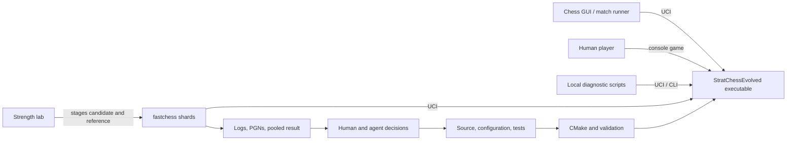
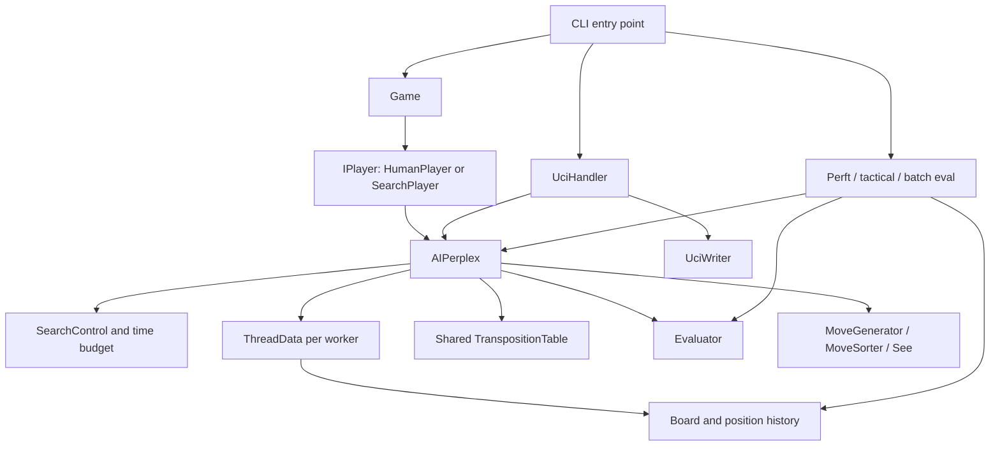
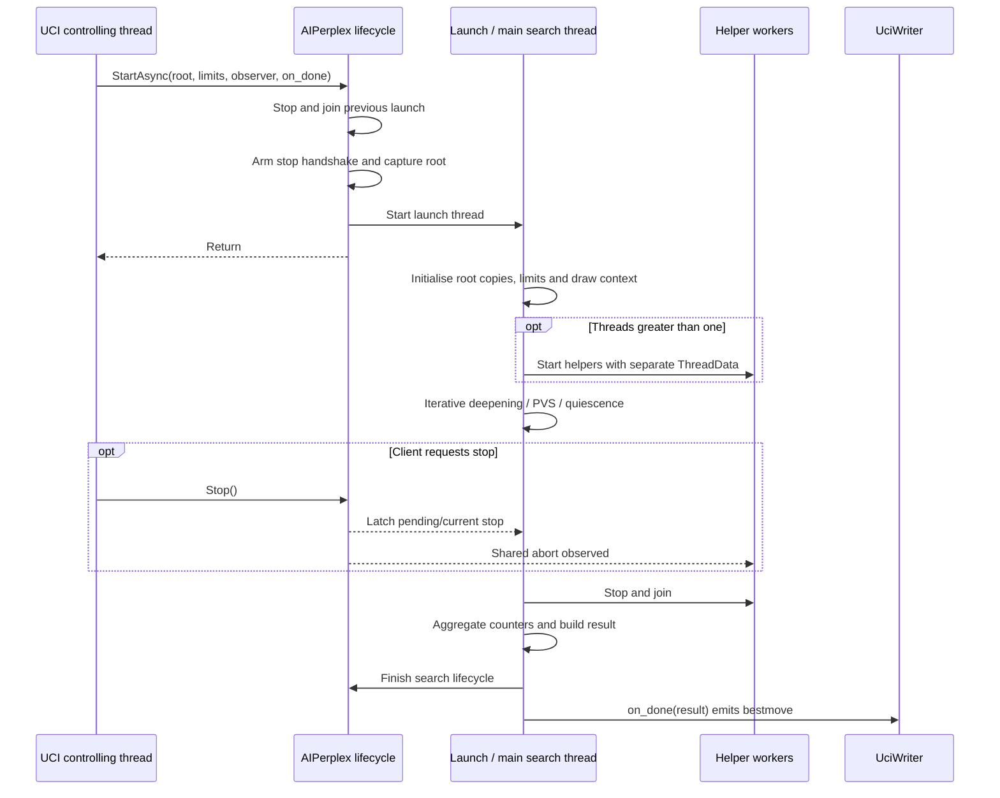
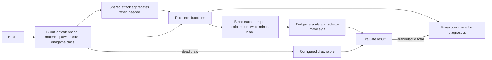

# Architecture: current system

Last verified: 2026-10-10.

**Purpose:** Explain how the current system fits together: module responsibilities, dependencies,
state ownership and lifetimes, and the flows connecting its major components. This document owns
the structural map and source navigation needed to locate a change.

[EngineGuide](EngineGuide.md) owns practical usage and output interpretation;
[EngineContracts](EngineContracts.md) owns non-obvious obligations when changing behaviour.
[CONTEXT](../CONTEXT.md) defines domain terms, [TestDesign](TestDesign.md) maps test surfaces,
and [Workflow](Workflow.md) owns validation and measurement choices. Summarize a boundary here
and link to its detailed contract or procedure at that owner.

## 1. System and consumers

The product is a C++23 chess engine with a UCI interface, an interactive game mode and diagnostic
CLI modes. The system context below includes the development feedback loop.

The diagrams below show logical modules and ownership; boxes do not imply separate processes,
libraries or virtual interfaces.

## 2. Logical modules

The `Player -> AIPerplex` edge belongs to `SearchPlayer`; `HumanPlayer` does not search. The
tools box is a collection of consumers: perft does not invoke evaluation or the search algorithm.

| Module | Responsibility and interface | Important dependencies / constraints |
|---|---|---|
| `Board` | Position, make/unmake, position metadata, hash and history | Search uses a copy. An opaque `PrefetchTarget` lets make/null-move prefetch the child's TT bucket without Board owning the table. |
| `Move` / `MoveFormatter` | Encoded move value / context-dependent presentation and parsing | [Move contracts](EngineContracts.md#moves). |
| `MoveGenerator` | Candidate moves and attack geometry | [Generation contract](../StratEngine/MoveGenerator.h). |
| `MoveSorter` / `See` | Ordering and static exchange judgement | Consume board and ordering state; ordering interacts with selective search. |
| `AIPerplex` | Root search, async lifecycle, iterative deepening, recursive search, result assembly | Owns TT, evaluator, search control, tuning and worker state. One controlling thread owns lifecycle/configuration calls. |
| `IterationPolicy` | Main-thread iteration acceptance, retained-result updates and continuation | Two pure value transitions; no Board, TT, clock or callback access. The driver supplies observations and owns side effects. |
| `ThreadData` | Per-worker position, PV, counters, history and recursion scratch | Includes several lifetimes: per-node, per-search and state retained between moves. Not a purely temporary search record. |
| `SearchLimits` / `Engine::resolve_limits` | Express per-search constraints and resolve them against configured defaults | Declared in `SearchLimits.h`, implemented in `SearchLimits.cpp`; returns depth, soft/hard time budgets and node limit. |
| `SearchControl` | Apply resolved limits, manage the stop latch and expose time/node checks | Soft time is checked at iteration boundaries; hard time and node limits can abort search. [Polling flow](#limit-observations). |
| `TranspositionTable` | Cache searched scores/bounds and ordering hints | Lock-free probes/stores; clearing is a lifecycle operation. Exposes an opaque `PrefetchTarget` for Board; receives keys, not Boards. |
| `Evaluator` | Static score and explanatory breakdown | Pure per-position term calculations plus a draw-score pair configured before search workers start. |
| `SearchTuningSchema` | Validate and bind configuration | `SearchTuning.def` is the catalogue; JSON and UCI exposure are deliberately not identical. |
| `UciHandler` / `UciWriter` | Protocol parsing, lifecycle coordination and serialized output | Owns a Board, concrete search instance and a separate unconfigured evaluator for `eval`. |
| `Game` / `GameStates` | Commit moves, adjudicate the played position and accumulate game totals / represent outcomes | Game keeps the played Board; search returns its root outcome through `SearchResult`. [Adjudication contract](EngineContracts.md#the-search-service). |
| `IPlayer` / `SearchPlayer` / `HumanPlayer` | Supply a move to Game; adapt concrete search or human input | `PlayerFactory` constructs configured players before type erasure. |
| `PVTable` / `PVIntegrity` | Per-worker PV storage / legal replay check at iteration emission | `ThreadData` owns the table; the search's Debug assertion checks emitted lines against the root. |
| `SearchTelemetry` / `TTStats` | Collect observations per worker, aggregate after joins and format diagnostic payloads | Returned in `SearchResult`; `UciHandler` emits through `UciWriter`. [Output reference](EngineGuide.md#interpret-search-output). |
| `Utils/Logger` | General, game-performance and opt-in UCI command sinks using spdlog | Search has a shared sink with per-service write gating. [Runtime files](EngineGuide.md#logging-and-runtime-files). |
| `Tools/Perft` / `Tools/TacticalTestRunner` | Move-generation traversal / tactical search consumers | CLI dispatches these independently of the Game loop. |

### Source navigation

| Area | Entry points |
|---|---|
| CLI and game composition | [main](../StratChessEvolved/StratChessEvolved.cpp), [Game](../StratEngine/Game.cpp), [PlayerFactory](../StratEngine/PlayerFactory.cpp), [GameState](../StratEngine/GameState.h) |
| Protocol | [UciHandler](../StratEngine/UCIHandler.h), [UciWriter](../StratEngine/UciWriter.h) |
| Search and worker state | [AIPerplex](../StratEngine/AIPerplex.h), [ThreadData](../StratEngine/ThreadData.h), [SearchControl](../StratEngine/SearchControl.h), [PVTable](../StratEngine/PVTable.h) |
| Position and moves | [Board](../StratEngine/Board.h), [MoveGenerator](../StratEngine/MoveGenerator.h), [MoveFormatter](../StratEngine/MoveFormatter.h), [Magic](../StratEngine/Magic.h) |
| Evaluation and ordering | [Evaluator](../StratEngine/Eval.h), [MoveSorter](../StratEngine/Sort.h), [See](../StratEngine/See.h) |
| Diagnostics and tools | [SearchTelemetry](../StratEngine/SearchTelemetry.h), [TTStats](../StratEngine/TTStats.h), [PVIntegrity](../StratEngine/PVIntegrity.h), [Tools](../StratEngine/Tools/) |
| Input, time and utility support | [Config](../StratEngine/Config.cpp), [Utils](../StratEngine/Utils/) (`FENParser`, `ArgParse`, `FenBatch`, `TimeManager`, `TimeUtils`, `Logger`) |

This is a map of entry points; the directory tree and headers own the full file and API inventory.

`Board` maintains both bitboards and a square-indexed mailbox, incremental Zobrist keys, repetition
history and ply-indexed undo state. Sliding attacks use compile-time tables indexed through PEXT:
[Magic.h](../StratEngine/Magic.h). These representations serve different queries on the same position.

### Configuration and input boundaries

| Input | Owner and destination |
|---|---|
| Build configuration | [CMakeLists.txt](../CMakeLists.txt) selects target definitions and compiler settings before execution. |
| Search tuning catalogue | [SearchTuning.def](../StratEngine/SearchTuning.def) defines fields and bindings; [SearchTuningSchema](../StratEngine/SearchTuningSchema.h) validates values for the search service. |
| Game configuration | [Config.cpp](../StratEngine/Config.cpp) reads JSON; [PlayerFactory](../StratEngine/PlayerFactory.cpp) constructs each configured player. |
| UCI options | [UciHandler](../StratEngine/UCIHandler.cpp) translates `setoption` into search-service configuration calls. |
| Per-search limits | UCI `go` and Game supply [SearchLimits](../StratEngine/SearchLimits.h); `Engine::resolve_limits` resolves defaults/budgets and [SearchControl](../StratEngine/SearchControl.h) applies them. |
| Positions | [FENParser](../StratEngine/Utils/FENParser.h) and `Board::SetupFromFEN` construct positions supplied through CLI, UCI or game configuration. |

[EngineGuide](EngineGuide.md#configure-a-run) explains how to use these inputs;
[EngineContracts](EngineContracts.md#configuration) defines validation and application obligations.
The strength lab drives UCI; its dispatchable inputs belong to [CI](CI.md).
Input recovery belongs to the consuming boundary; the [threat model](Workflow.md#threat-model)
explains the robustness goal.

### Search mechanism index

This is navigation into [AIPerplex.cpp](../StratEngine/AIPerplex.cpp), not a second catalogue of
defaults or algorithms. Tuning field families below are defined in
[SearchTuning.def](../StratEngine/SearchTuning.def); eligibility and correctness guards remain in
the implementation and [search contracts](EngineContracts.md#search-internals).

| Mechanism | Implementation entry | Control / related state |
|---|---|---|
| Iteration acceptance and continuation | [IterationPolicy](../StratEngine/IterationPolicy.h): `Engine::assess_iteration`, `Engine::continue_iteration` | `min_nodes_threshold`, `min_completion_ratio`, `min_pv_ratio`; retained result and one-extension state |
| Time and node observations | `SearchControl`, iterative-deepening loop | Per-search limits and abort latch; soft-limit sample acquired after the iteration observer |
| Aspiration windows | `search_with_aspiration` | `aspiration_*` |
| PVS and TT cutoffs | `pvs` | Window/node type, TT bound and depth, exclusion-frame restrictions |
| Reverse futility | `reverse_futility_eligible`, `pvs` | `reverse_futility_*` |
| Null move | `should_try_null_move`, `pvs` | `null_move_*`; worker recursion state |
| Singular extension | `pvs` verification search | `singular_*`; TT evidence and excluded move |
| Singular multi-cut | `singular_multicut_eligible`, `pvs` after the verification | `singular_multicut_enabled`; fail-hard `beta`, no TT store |
| Frontier futility | `frontier_futility_eligible`, `pvs` | `frontier_futility_*` |
| Late move pruning | `late_move_pruning_eligible`, `pvs` | `late_move_pruning_enabled`; thresholds in [AIPerplex.h](../StratEngine/AIPerplex.h) |
| Late move reduction | `pvs` reduced search and re-search; `lmr_reduction` in [AIPerplex.h](../StratEngine/AIPerplex.h) | `lmr_*`, including history adjustment through `lmr_history_divisor`; move classification and ordering |
| Quiescence delta / SEE pruning | `quiescence` | `delta_pruning_margin`, `see_pruning_enabled`, `see_pruning_margin`; material and check guards |
| Move ordering and history | [MoveSorter](../StratEngine/Sort.h): `ScoreMovesBestFirst` / `OrderRemaining` in `pvs`; `ScoreMoves` for in-check quiescence; `order_quiescence_moves` | Lazy main-search ordering; hash move, SEE tiers, killers, history and `continuation_history_plies`. [Ordering contract](EngineContracts.md#search-internals). |

### Limit observations

`SearchControl::ApplyLimits` calls `Engine::resolve_limits`, then arms the time budgets and node
limit. The main worker samples `ShouldStopIteration()` after an iteration for the soft-time
continuation decision. In the recursive per-node polling path, only thread 0 checks the hard clock
and node limit, every 1024 calls; the node limit uses that worker's combined main/quiescence count.
Helpers also call `StopRequested()` at aspiration retry boundaries and the LMR re-search guard,
so they can observe hard-clock expiry directly. All workers use `IsAborted()` to read the shared
stop latch without a clock call. See [SearchControl.cpp](../StratEngine/SearchControl.cpp) and
`poll_search_limits` in [AIPerplex.cpp](../StratEngine/AIPerplex.cpp).

## 3. State ownership and lifetimes

| State | Owner | Lifetime / access |
|---|---|---|
| Played or analysed root Board | UCI or Game | Caller may prepare another position after the search lifecycle allows it. Search never writes results into this Board. |
| TT allocation, tuning, evaluator, helper-state allocations | AIPerplex | Persist across searches. Tuning changes clear TT contents; new-game reset clears accumulated game state. |
| Root colour and evaluator draw scores | AIPerplex / its evaluator | Established before helper creation; read-only during search. Nonzero contempt also affects TT validity. |
| Board, PV, node counters, telemetry | One `ThreadData` per worker | Board copied from root; counters reset for each search. Mutable only by that worker while searching. |
| Board's opaque `PrefetchTarget` | Stored on each worker Board; refers to AIPerplex's TT | Bound after copying the root at search start; reset to the dummy target after helper joins on every exit. [Lifetime contract](EngineContracts.md#the-search-service). |
| History and continuation history | Same worker state | Retained and aged within a game, reset for a new game. Ordinary and continuation history have different ageing schedules. |
| Excluded move, continuation keys, null-move flags | Worker recursion state | Ply-indexed scratch. Singular verification re-enters at the same ply and must restore the surrounding frame's state. |
| TT entries | Shared table | Lock-free probes/stores during search; mutex-serialized clearing at lifecycle boundaries. [Concurrency obligations](EngineContracts.md#search-internals). |
| Limits and abort latch | SearchControl | One search; stop can be requested concurrently. |
| Retained iteration result and soft-limit extension | Local `Engine::IterationState` in main iterative deepening | One search; passed through the policy's value transitions. Helpers do not use it. |
| Iteration observer and completion callback | One search/launch | Observations are snapshots. Completion runs after search has finished, on the launch thread. |
| Final SearchResult | Returned value owned by caller | Assembled after helper joins; later searches cannot overwrite it. |

### UCI launch and completion

The root is captured for asynchronous launch and copied into worker Boards. Helpers contribute TT
entries and work counts; their best moves are not selected as independent candidates. Main search
remains authoritative. `Threads=1` avoids helper spawning.

Controlled fixed-depth searches at one thread, with identical configuration and initial state,
support node-identical comparisons. Timed or externally interrupted searches need not finish at
the same point even at one thread. Lazy SMP adds scheduling-dependent shared-TT interactions;
the [equivalence check](../Scripts/Compare-SearchEquivalence.ps1) deliberately uses one thread.

TT entry storage uses a Linux allocator that requests huge-page backing for sufficiently
large allocations. `MADV_HUGEPAGE` is advisory; Windows uses the standard allocator path.
See [TranspositionTable.cpp](../StratEngine/TranspositionTable.cpp) and
[TranspositionTable.h](../StratEngine/TranspositionTable.h) when comparing platform-sensitive costs.

For abort unwinding, singular-verification restrictions and exact callback/lifecycle obligations,
see [EngineContracts](EngineContracts.md#search-internals).

## 4. Evaluation data flow

`EvalContext` is stack-local; individual terms do not mutate a shared accumulator or each other's
state. Shared attack generation already avoids repeating expensive slider work across mobility,
rook and king-safety terms. Integer blending happens per term and colour, so moving the blend after
summation would change scores through rounding.

`Breakdown` uses the production context and term functions and obtains its total from `Evaluate`.
It deliberately repeats some work on a diagnostic path. It is a real second consumer of the term
calculations, and many tests already use it. A breakdown is not yet an exported vector of tunable
features: it contains weighted, blended contributions, including nonlinear and conditional work.

Source: [Eval.cpp](../StratEngine/Eval.cpp), especially `BuildContext`, `RawWhitePov`, `Evaluate`
and `Breakdown`; [EvalTestFixture.h](../StratChessTests/EvalTestFixture.h).

## 5. Build, tests and diagnostic boundaries

Both executables compile the engine sources. The production Release target enables LTO when
supported; the test executable does not. Tests define `STRAT_ENABLE_TEST_ACCESS` and always enable
`STRAT_SEARCH_PROFILE` and `STRAT_TT_STATS`. The production target makes those two counter families
optional. [CMakeLists.txt](../CMakeLists.txt) owns the definitions; these observations explain why
the test binary and the production binary are distinct validation surfaces.

Windows targets reserve an 8 MiB stack (`/STACK:8388608`) for executable and worker stacks;
initial commitment is unchanged. This build setting supports the recursive search's stack use.

Search workers collect telemetry locally; after joining helpers, `AIPerplex` aggregates it into
the returned result. `SearchTelemetry` formats the payloads and `UciHandler` serializes their
emission through `UciWriter`. `PVIntegrity` separately supports a Debug assertion at iteration
emission. Instrumentation output and logging serve external consumers described in
[EngineGuide](EngineGuide.md#interpret-search-output); they are not independent search services.

Local scripts and CI invoke the production executable through UCI or diagnostic CLI commands.
The strength lab stages candidate/reference binaries, runs match shards and collects results;
its orchestration belongs to [CI](CI.md). [Workflow](Workflow.md#what-validates-what) explains
correctness and equivalence evidence, and [TestDesign](TestDesign.md) maps test coverage.
[measure-strength](../.claude/skills/measure-strength/SKILL.md) owns experiment procedures and
the limits of profile, bench and Elo evidence.
Recorded evidence lives in [Measurements](../Measurements/README.md).

## 6. How to maintain this map

Update the affected ownership row, source link and diagram in the PR that changes a responsibility,
dependency, interface or state lifetime. Check the opening purpose before adding a section:
usage and output examples belong in EngineGuide, precise obligations in EngineContracts, and
validation procedures in Workflow or the relevant skill. Keep brief linked context here when
needed to understand a boundary; keep algorithms, field catalogues and numeric defaults with
their implementation owners. Historical findings belong in dated reviews and measurement records.

Update the verification date after checking the affected descriptions against source. A date
records a documentation check, not a claim that tests proved every statement.
