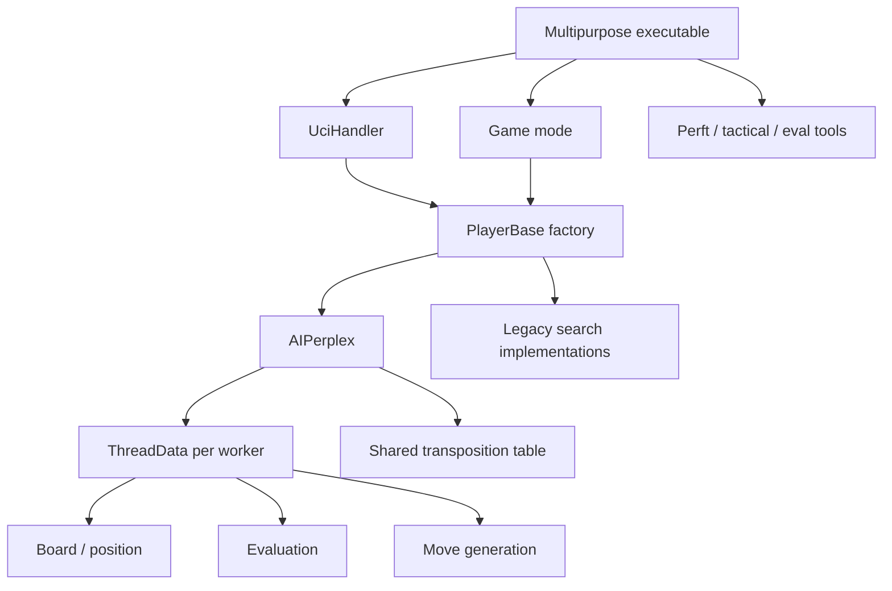
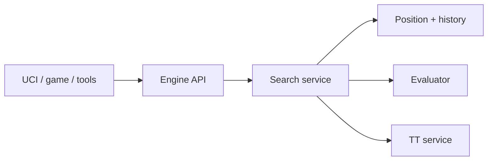

# StratChess Architectural and Design Review

**Repository:** `theEscape2207/StratChess`  
**Reviewed snapshot:** `eb8fcb917bee08c91118e1ee2ddb3188e3b5a4c2`  
**Review date:** 2026-08-09  
**Addendum added:** 2026-08-10, verified against `77fa3f0e31bb8cd18d87fbc93d72769d31a3839b`
and the issue tracker at that commit

> **Two documents in one file.** This section is a project-aware **addendum**: what the original
> review could not know, and where its recommendations were revised. The **original review,
> preserved verbatim** begins at `## Executive summary` below — a point-in-time assessment of the
> commit named at the top of this file.
>
> The original body is deliberately frozen rather than corrected, because its value is as evidence
> of what an unbriefed reading of the tree produced. It therefore still recommends things the
> addendum rejects — the `strat_engine` static library appears in its Executive summary, its P1 and
> its Recommended roadmap. **Where the two disagree, the addendum wins.**
>
> The addendum may be extended as issues progress. Neither part should be rewritten to describe the
> current tree; supersede this file with a new dated review instead.

## Status and project context

This review was produced by an agent working **without project background** — no access to the
issue history or to decisions recorded in `Docs/`.

Most of its code-level observations held up under spot-checking: the P3 documentation drift, the
`UciHandler` downcasts and the `PlayerAiBase` legacy members all verified exactly. The gaps recorded
below are of two kinds: the tool-source example is factually correct but missing the consumer
context that decides what to do about it, and P1's enumeration of concurrent UCI writers is
incomplete (it omits `cmd_uci()`). What the review lacks more broadly is the record of what has
already been decided, and why.

Read the following alongside it.

### The findings have been triaged into issues

| Review finding | Issue | Outcome of triage |
|---|---|---|
| P1 — UCI output serialization | **#249** | Accepted. Narrowed to a mutex in `send()` plus one stress test; batched with #247/#243. Two proposed test criteria were dropped as non-probative *for output atomicity*: TSan cannot observe it in principle, and `uci_race_probe.py` tests the #245 ordering regression — which it does detect — rather than this defect |
| P1 — TT synchronization | **#250** | Accepted as **measurement-first**. The rewrite is deferred until measurement justifies it; triggers for revisiting are named in the issue |
| P1 — no reusable engine-core target | **#251** | **Substantially revised** — see below |
| P2 — main executable has too many roles | **#251** | Folded in; the separate-binaries part is deferred with a named trigger |
| P3 — documentation drift | **#253** | Accepted and widened; the omissions turned out to matter more than the broken references |

Also opened from this review: **#254** (no UCI `Hash` option) and **#252** (the TT allocates less
than requested and misreports it), neither of which the review identified. #252 is now fixed by
PR #258.

The "25%" in #252's title is about **entry storage**: a 256 MiB request allocates 192 MiB of
entries. Total footprint differs again, because the parallel lock array is counted in neither
figure — roughly **208 MiB on Windows and 304 MiB on Linux** for a nominal 256 MiB table, since
`sizeof(std::shared_mutex)` is 8 on the MSVC STL and 56 on libstdc++. Quoting "allocates 25% less"
without saying *less of what* contradicts those totals.

### Where the review should not be followed as written

**The engine-library recommendation contradicts a decided question.** P1 recommends "a single
`strat_engine` static library is an appropriate first step." That is precisely what **#83**
proposed and it was closed *not planned after measurement*: the saving was ~25-30 s of PR feedback,
against `STRAT_ENABLE_TEST_ACCESS` and LTO risk. **#83 itself estimates 5-15% nps** if a
misconfigured consuming linker silently drops cross-TU inlining. (`CMakeLists.txt:238-246` records
the current topology and why Phase 0 left it alone; the percentage is #83's, not CMake's.) The
review does not cite #83, and its "without changing runtime behavior" claim is what that analysis
disputes. The roadmap also places this — the highest-risk item in the document — in the near-term
bucket, ahead of much safer work.

**The four-library structure is over-engineered for this project.** `strat_position` /
`strat_search` / `strat_uci` / `strat_tools` presumes multiple consumers or independent release
cycles; there is one production consumer.

An earlier draft of this addendum argued that if LTO crosses such a boundary the boundary is
"notional". That was a false dichotomy and is corrected rather than deleted: a target boundary
enforces source ownership, dependency direction and visibility whether or not the optimiser inlines
across it. Those benefits are real and they survive LTO.

The case against compiled libraries *here* is cost against present need, not architectural
futility. `strat_position` ↔ `strat_search` is the hottest boundary in the program (move generation
and evaluation called from `pvs()`), so it is exactly where a mishandled LTO configuration would
cost the most — against a benefit #83 measured at ~25-30 s of PR feedback, with no second consumer
asking for it. #251 therefore expresses **ownership** without introducing compiled artifacts, and
defers the artifacts until a measured need or a second consumer appears.

**The tool-source example lacks the consumer context that decides it.** The inclusion facts are
correct: `StratEngine/Tests/Perft.cpp` and `TacticalTestRunner.cpp` are compiled into both
executables. What the review could not know is that both have **deliberate production consumers** —
`Perft.cpp` backs the UCI `go perft` command that `Run-PerftCheck.ps1` drives across the
142,953-position corpus, and `TacticalTestRunner.cpp` backs the `tactical` CLI mode that
`Validate-PrePR.ps1` runs as step 3 of the required gate.

So the facts stand, and the *ownership* argument built on them survives. What does not survive is the
implication that these files are candidates for eviction into an exclusive tools target: there is no
glob residue here to remove, only a real dependency the build does not name.

### Corrections and additions to the P2 findings

**The proposed `SearchEngine` interface drops a required output, not just a parameter.** The current
`GetMove(GameInfo&, const SearchLimits&)` propagates root state back through that reference, and
`AIPerplex::GetMove()` fires `EGameStateChanged` from `info.gameState`. Game mode consumes it.

The requirement is the **output semantic, not the carrier.** A replacement must not keep the mutable
`GameInfo&` merely to preserve the behaviour — that would retain precisely the legacy coupling the
redesign exists to remove. Returning the resulting game state as part of a revised `SearchResult`
would satisfy it and be cleaner. What must not happen is dropping the semantic silently, which is
what the proposed signature does.

**The interface has negligible search cost,** which the review does not say and should: one virtual
call per move, outside the per-node hot path.

**P2's motivation is weaker than P2's case.** "Introduce a concrete-independent interface" reads as
speculative generality with a single implementation. The honest and stronger motivation is the
second half of the same finding — stop production search inheriting a hierarchy built for retired
algorithms. Supporting evidence the review missed: `PlayerAiBase` carries process-global mutable
statics (`m_TotalTime`, `m_TotalCount`, `PlayerAI.h:248-249`), mutated non-atomically in
`StopTimerAndAdjustVars()`. Not a demonstrated race — searches are serialized and helpers never
call it — but it is exactly the baggage the migration exists to shed.

### The strategic gap

Nine roadmap items, none of which improves playing strength. That is defensible for a document
scoped as an architecture review, but it should not be adopted as *the* roadmap. `CLAUDE.md` states
the goal as **measured positive Elo, not nps**; the project's strongest asset is a working SPRT
strength lab; and the eval-improvement epic (**#110**, 12 sub-issues) goes unmentioned.

Architecturally this engine is in good shape, and the structural debt this review documents is real
— #256 exists because of it. But structure is **not the current Elo bottleneck**: the nearest
strength gains are search and evaluation *features*, and nine structural roadmap items should
complement that work rather than displace it.

---

# Original review — preserved verbatim

*Written without project context on 2026-08-09. Not edited and not maintained. Recommendations here
are superseded wherever the addendum above identifies them — most importantly the `strat_engine`
static library, which #83 already closed after measurement.*

## Executive summary

StratChess is technically mature for an independently developed chess engine. It already has explicit board instances, per-thread search state, a shared transposition table, per-call search limits, extensive Catch2 coverage, sanitizer and TSan jobs, deep perft, tactical-stability testing, UCI race probes, and an automated strength lab.

The principal architectural constraint is no longer a lack of engine functionality. Application concerns, UCI protocol handling, developer tools, legacy player abstractions, and the production search remain bundled into one broad layer. That makes concurrency boundaries harder to enforce, causes implementation-specific downcasts, and prevents the build system from expressing a reusable engine-core boundary.

The recommended direction is evolutionary rather than a rewrite:

1. Serialize all UCI output through one boundary.
2. Create a reusable engine library target.
3. Introduce a concrete-independent search interface.
4. Move production search away from the legacy player inheritance hierarchy.
5. Revisit transposition-table concurrency as a measured performance project.
6. Split the multipurpose entry point and refresh architecture documentation.

## Current architecture



The desired dependency direction is:



## Priority findings

### P1 — UCI output lacks a single serialization point

The command loop and search thread can both write to `std::cout`. `UciHandler::send()` performs a message insertion, a newline insertion, and a flush as separate operations. The command thread can emit `readyok`, evaluation output, and refusal diagnostics while the search thread emits `info` and `bestmove`.

The standard library prevents internal corruption of the stream object, but it does not make a multi-operation logical line atomic. Two threads can therefore interleave text or separate a message from its newline. A malformed UCI line can be ignored or misparsed by a GUI and is difficult to reproduce because it depends on scheduling.

Introduce a single output abstraction, such as `UciOutput::send_line(std::string_view)`, and route every protocol line through it. The lowest-risk implementation is a mutex covering construction and emission of one complete line. `std::osyncstream` is also viable in C++20. A dedicated output thread is unnecessary at the engine's current output volume.

Tests should cover:

- `isready` and diagnostic output while a search is active.
- Concurrent complete-line emission under repeated scheduling pressure.
- Exactly one newline per message and no merged or fragmented messages.
- Existing `bestmove` ordering and UCI race probes.

Expected NPS impact is effectively zero because serialization occurs only at the protocol boundary, not in `pvs()`, quiescence, move generation, evaluation, or TT access. Expected intrinsic Elo impact is also neutral. It can nevertheless prevent rare protocol-corruption losses, which is an operational correctness improvement rather than a search-strength gain.

### P1 — Transposition-table synchronization is on the search hot path

Every TT probe takes a `std::shared_mutex` shared lock, every store takes its exclusive side, and the table allocates one mutex per bucket. This creates synchronization and memory overhead proportional to table size, reduces cache density, and can limit Lazy SMP scaling.

The eventual design should use compact, cache-aligned entries with atomic publication or another concurrency scheme that remains valid under the C++ memory model. This must be treated as a measured performance project rather than a cosmetic refactor. Validation should include NPS, scaling by thread count, TSan, tactical stability, and Elo.

### P1 — The build has no reusable engine-core target

CMake recursively gathers `StratEngine/*.cpp`, excludes only `Archived`, and compiles that collection directly into both the engine and test executables. The production executable therefore includes `StratEngine/Tests/Perft.cpp` and `TacticalTestRunner.cpp`, while engine sources are compiled twice.

Recommended target structure:

- `strat_position`: board, moves, move generation, FEN, hashing.
- `strat_search`: evaluation, ordering, TT, time management, AIPerplex.
- `strat_uci`: protocol adapter.
- `strat_tools`: perft, tactical, corpus and diagnostic commands.
- Separate production and test executables.

A single `strat_engine` static library is an appropriate first step. More granular libraries should follow only when their boundaries are useful and measurable.

### P2 — UciHandler depends on concrete implementations

`UciHandler` downcasts to `PlayerAiBase`, `AIPerplex`, and `EvalComplex` for configuration, search results, and evaluation breakdowns. `Game` contains similar implementation-specific branching. These downcasts show that the abstractions do not expose the capabilities their consumers actually need.

Introduce a production-oriented interface similar to:

```cpp
class SearchEngine {
public:
    virtual ~SearchEngine() = default;
    virtual SearchResult search(const Board&, const SearchLimits&) = 0;
    virtual void stop() noexcept = 0;
    virtual void set_threads(unsigned) = 0;
};
```

Evaluation breakdown can be an explicit evaluator capability. UCI should translate protocol commands into engine calls without knowing which concrete search or evaluator implements them.

### P2 — The player hierarchy contains two generations of search state

`PlayerAiBase` retains legacy members for the board, move sequence, best move, node counts, evaluation, timing, events, and game-state propagation. `AIPerplex` separately maintains `ThreadData`, helper states, its shared TT, tuning, logging, and `SearchResult`.

The `ThreadData` extraction is a strong improvement, but production search remains constrained by a base class designed for older algorithms. The migration path is:

1. Introduce the independent search interface.
2. Adapt `AIPerplex` to that interface.
3. Make game-mode AI players wrap the search interface.
4. Move nostalgic algorithms behind a legacy or tooling target.

### P2 — The main executable has too many roles

The entry point contains UCI, game mode, perft, tactical stability, batch evaluation, FEN integration testing, and a retired unit-test command. This mixes production protocol behavior with developer tooling and makes command-specific output contracts harder to isolate.

Extract each mode into a focused runner. Longer term, separate the UCI engine from developer tools if the additional binaries do not complicate distribution.

### P3 — Architecture documentation has drifted

`Docs/Engine-Readme.md` contains a quick-start call to a nonexistent single-argument `GetMove(info)` and lists `globals.h` and `typedef.h`, neither of which exists. The algorithmic documentation remains valuable, but inventories and examples should be kept executable or generated where practical.

## Architectural strengths

- `Board` is explicit, copyable state rather than a singleton.
- Make/unmake history, hashing, material, repetition, and side-to-move invariants are encapsulated together.
- `ThreadData` gives each Lazy SMP worker its own board, PV, history, killers, and counters.
- The TT is passed explicitly to recursive search functions as shared state.
- `SearchLimits` is a per-call value object rather than mutable pre-search configuration.
- Search and evaluation behavior have extensive focused tests.
- Validation includes fast and slow Catch2 tiers, sanitizers, TSan, deep perft, tactical stability, race probes, benchmarks, and differential Elo measurement.
- Comments record subtle concurrency and board-state invariants, including the `bestmove` ordering failure fixed by PR #246.
- FEN and other external inputs are treated as architectural boundaries rather than trusted internal data.

## Recommended roadmap

### Near term

1. Add atomic UCI line emission and concurrency-focused regression tests.
2. Refresh `Docs/Engine-Readme.md` examples and file inventory.
3. Extract a single reusable `strat_engine` library without changing runtime behavior.

### Medium term

4. Define the production search interface and migrate UCI to it.
5. Split tool runners from the main translation unit.
6. Adapt game-mode players around the production search interface.

### Performance research

7. Establish single-thread and multi-thread TT baselines.
8. Prototype a compact concurrent TT representation.
9. Require NPS, scaling, TSan, tactical-stability, and Elo evidence before adoption.

## Review scope

This was a static architectural and design review of the repository at the commit recorded above. It did not change engine behavior and did not establish a fresh build or test result.

